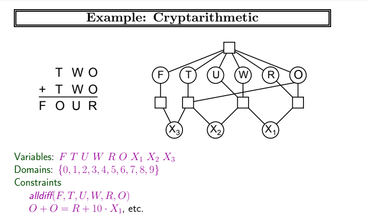

# Constraint Satisfaction Problem

This project was done to finish a homework I wasn't feeling like doing it
with my bare hands and I decided to automate it. The problem is to solve a
constraint satisfaction problem (CSP), basically you have to find a solution
to a problem that satisfies a set of constraints. In this case, the problem
is to find a solution to the following problem:

The final result can be found in [this file](index.html), just run it in your
browser and you will see the solution.
